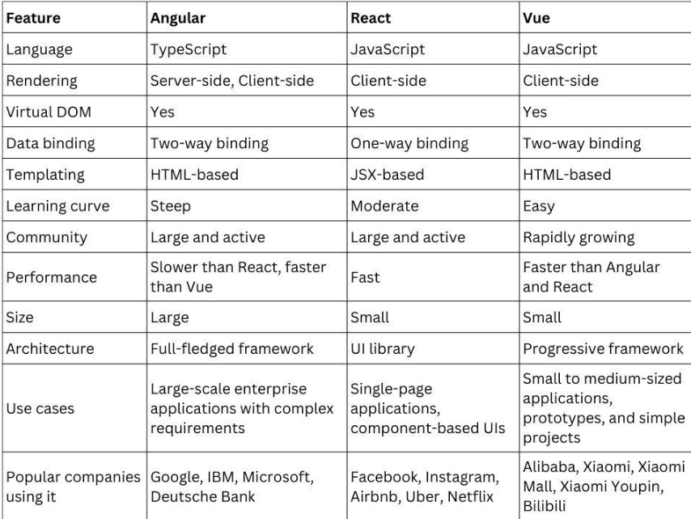
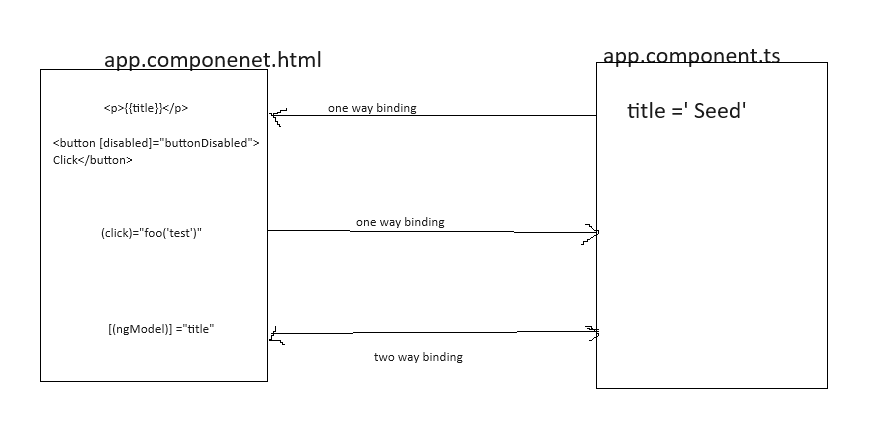

# Angular
## why Angular?
1.  Angular is an open source front-end JS framework.
2.  Angular uses modular components to increase code reuse.
3.  Angular application in written in TS.
4.  Angular has been used long enough and has support.

## what is Angular
        Angular is javascript framework that allows you to create a single page application(SPA).

## Difference between Angular, React & Vue   
    

## Angular Setup
1. Install visual studio code ide
    https://code.visualstudio.com/download

2. Install node js (window installer 64 bit)
    https://nodejs.org/en/download
    
        to test , run the below command 
        node -v
        npm -v

3. Install angular CLI
    - execute the below command
  
            npm install -g @angular/cli

    - to check angular is installed, execute the below command

            ng version

## create the new project 
    To run the project online
        https://ng-run.com/
        
### Angular 17 (it will create a standalone project)
    ng new <project_name>
    ng new 01_demo

    Which stylesheet format would you like to use? (Use arrow keys)
    >css
    Do you want to enable Server-Side Rendering (SSR) and Static Site Generation (SSG/Prerendering)? (y/N) N

### Angular 16
    ng new <project_name>
    ng new 01_demo
    Which stylesheet format would you like to use? (Use arrow keys)
    >css
    Would you want routing? (y/N) Y

### Angular 17 similar to Angular 16 structure (preferable)
    syntax: ng new <project_name> --standalone false
    eg: ng new 02_demo --standalone false

    
    Which stylesheet format would you like to use? (Use arrow keys)
    >css
    Do you want to enable Server-Side Rendering (SSR) and Static Site Generation (SSG/Prerendering)? (y/N) N

### run the project
    syntax: cd project_folder
    eg: cd 02_demo2
    npm start 
    or
    ng serve

    ? Would you like to share pseudonymous usage data about this project with the Angular Team
    at Google under Google's Privacy Policy at https://policies.google.com/privacy. For more
    details and how to change this setting, see https://angular.io/analytics. (y/N) N

### add the bootstrap in the project 
    cd project_path
    npm install bootstrap@3

-   add the path in angular.json file(styles property) (line no 37)

        "./node_modules/bootstrap/dist/css/bootstrap.min.css",

- changes in the angular files will look like as below

        "styles": [
              "./node_modules/bootstrap/dist/css/bootstrap.min.css",
              "src/styles.css"
            ],

- to learn more about bootstrap

    https://bootstrapdocs.com/v3.0.3/

## Component
    Mostly have four files
- component-name.component.html
- component-name.component.ts
- component-name.component.css
- component-name.component.spec

### create the component using cli
    ng generate component <component_name>
    ng g c <coponent_name>

- if you want to create component without spec file
  
        ng g c people --skip-tests

## binding

[binding example (ts file)](./99_project/Day_02_binding/app.component.ts)
[binding example (html file)](./99_project/Day_02_binding/app.component.html)

## Directive
    Directives are defined as classes that can add new behavior to the elements in the template or modify existing behavior. The purpose of Directives in Angular is to maneuver the DOM, be it by adding new elements to DOM or removing elements and even changing the appearance of the DOM elements

### Types of directive
1. component
2. structural (ngIf, ngFor, ngSwitchCase)
3. attribute (ngStyle, ngClass)
   - ngStyle
  
            [ngStyle] ="{key:value}".  
            key = style-name
            value = value of style

            eg: [ngStyle]="{'backgroundColor':'red'} 
            [ngStyle]="{backgroundColor:color} 
   - ngClass
  
            [ngClass]="[className]"
            [ngClass] ="{key:value, key:value}"
            key = className
            value = condition (whether you want to apply)

### @Input()
    to initialize the property of one component from another component.

### selector

    @Component({
        selector: 'app-person',
        templateUrl: './person.component.html',
        styleUrl: './person.component.css'
    })

    <app-person></app-person>       element selector
    

          attribute selector     
    

  class selector

    ng g c selector/element-selector --skip-tests
    ng g c selector/attibute-selector --skip-tests
    ng g c selector/class-selector --skip-tests

    <!-- element selector-->
    <app-element-selector></app-element-selector>

    <!-- attribute selector-->
    

    <!-- class selector -->
    

## @Output

## local reference
    The nameing convention of localreference is #variableName
    

    Example:
      

        

            

                <h3 class="panel-title">Cockpit Component</h3>
            

            

                

                    

                    
Add new Servers or Bluprints

                    <label for="name">Name</label>
                    <input type="text" class="form-control" #nameInput >  <!--local reference-->
                
                    <label for="content">Content</label>
                    <input type="text" class="form-control"  #contentInput>
                     
                
                    <button class="btn btn-primary" (click)="onAddServer(nameInput.value, contentInput.value)">Add Server</button>
                    <button class="btn btn-primary" (click)="onAddBlueprint(nameInput.value, contentInput.value)">Add Server Blueprint</button>
                    

            

        

        

    

## local reference using @ViewChild
    

              
Add new Servers or Bluprints

              <label for="name">Name</label>
              <input type="text" class="form-control" #nameInput >
        
              <label for="content">Content</label>
              <input type="text" class="form-control"  #contentInput>
               
    

    
    import { Component, ElementRef, ViewChild } from '@angular/core';

    export class CockpitComponent {

        @ViewChild('nameInput') nameInput:ElementRef;
        @ViewChild('contentInput') contentInput:ElementRef;

        onAddServer(){
            const name = this.nameInput.nativeElement.value;
            const desc = this.contentInput.nativeElement.value;
            this.onAddServerEvent.emit({name,desc});

        }
       
    }

## ngContent
    greet.component.html
     
Hello

    <app-greet>Jack</app-greet>
    <app-greet>Sam</app-greet>

    output: 
       Hello
       Hello

    
    greet.component.html
     
Hello
 <ng-content></ng-content>

    <app-greet>Jack</app-greet>
    <app-greet>Sam</app-greet>

    output: 
       Hello Jack
       Hello Sam
     

## lifecycle
constructor
1. ngOnChanges  => called after a bound input property changes
2. ngOnInit => called once the component get initalized
3. ngDoCheck => called during every change detection run
4. ngAfterContentInit => 
5. bgAfterContentChecked =>
6. ngAfterViewInit =>
7. ngAfterViewChecked =>
8. ngOnDestroy => called once the component is about to be destroyed or removed.

# Service
    To share the data/logic between the component => @Input/@Output
    Another option is service.

    Service is the class used to separate the logic from view.
    

## cli command
    ng g s service-name
    ng g s service-name --skip-tests

## way to declare or use the service
1. @Injectable

        @Injectable({
            providedIn: 'root'
        })

2. @NgModule --lazy binding

    [ngModule](./03_demo/src/app/app.module.ts)

        refer to LogService

3. @Component

        @Component({
        selector: 'app-service-example2',
        templateUrl: './service-example2.component.html',
        styleUrl: './service-example2.component.css',
        providers: [Example2Service]
        })

# Routing: 
    In a single-page app, you change what the user sees by showing or hiding portions of the display that correspond to particular components, rather than going out to the server to get a new page. As users perform application tasks, they need to move between the different views that you have defined.

    To handle the navigation from one view to the next, we use the Angular Router.

## path param/path variable
     app-routing.moduele.ts
        {path:'emp/:name', component:any component}
    
     name is the path vaiable

### read path variable
    inject ActivatedRoute
    constructor(private route:ActivatedRoute){}

    this.route.snapshot.paramMap.get('name');

## navigate programatically
   inject Router
   constructor(private router:Router){}

   this.router.navigateByUrl(path);

    

