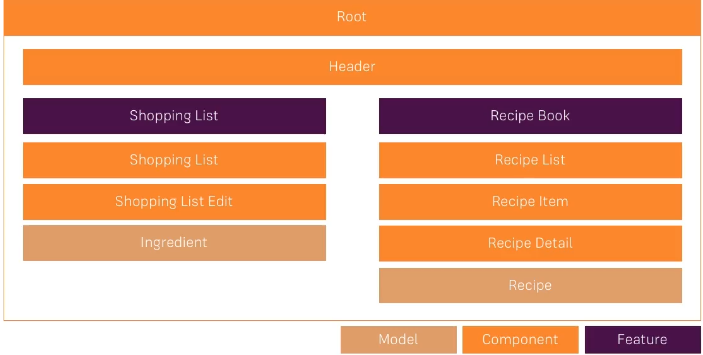

# Assignment 01
    create the project: assignment
    create two component => servers, server
    ng g c servers
    ng g c server

    servers.component.ts
    servers{name:string, desc:string}[] =[];
    

        <app-server [name]="item.name"  [desc]="item.desc"></app-server>
    

    html
    <app-server> with a loop passing the value

    server
    name
    description

# Assignment 02
    In app.component
    serversOrBluePrints:{name:string, content:string, type:string}[] = [];
    type = server or blueprint

    In Html, display the panel with the details.

# Assignment 03
    create three component
    compA => call compA as element selector
    compB => attribute selector
    compC => class selector

# Assignment 04
    create the component evenOdd
    initally, It will display number 1 to 10;
    for even number, text will be in blue color
    for odd number, text will be in red color
    add two button 
        button1 => Even
        button2 => Odd

# Assignment 05
   do the pratice of pipe operator

# Assignment 06
    create three component
    ng g c banner
    ng g c button-counter
    ng g c message

    Banner compoenent (call banner component in app component)
    -------------------
    <app-message></app-message>
    

    <app-button-counter></app-button-counter>

    ButtonCount component
    ---------------------------
    <button></button>
    button clicked 1 time(s);

    MessageComponent
    ---------------------
    if button clicked 5 times then display the message
    5 => Congratulation, Button clicked 5 times. You are eligible for silver button.
    10 => Congratulation, Button clicked 10 times. You are eligible for Golden button.
    20 => Congratulation, Button clicked 20 times. You are eligible for Platinum button.

# Project Recipe

    ng new recipe-project
    cd recipe-project
    npm install bootstrap@3

    add the bootstrap path in angular.json

    ng g c header/header --skip-tests

## Recipe

    ng g c recipes --skip-tests
    ng g c recipes/recipe-list --skip-tests
    ng g c recipes/recipe-detail --skip-tests
    ng g c recipes/recipe-list/recipe-item --skip-tests

## shopping-list
    ng g c shopping-list --skip-tests
    ng g c shopping-list/shopping-edit --skip-tests

